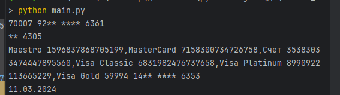

# homework-python
## О проекте
Проект создан в целях ознакомления с python-разработкой в рамках домашнего задания во время обучения.
## Инструкции
По установке:
  * Для PyCharm:
    1. клонировать репозиторий, введя в терминале git clone https://github.com/Kulikov-Vasiliy/homework-python
    2. установить зависимости через активированное виртуальное окружение: pip install -r requirements.txt(пока не добавлено в проект)
  * Для GitHub:
    1. на странице проекта на кнопке <> Code открыть выпадающий список
    2. выбрать download zip или клонировать через ссылку https или ssh
По применению проекта:
1. открыть модуль main через pycharm
2. можно поменять значения в функции print по образцу или заменить образец на функцию input(), однако вводимое значение для корректной работы модуля следует по образцу
3. можно "убрать из чтения" не интересующие функции, поменяв метод ввода на eng(язык ввода alt+shift) и воспользовавшись комбинацией ctrl+/ для комментирования, так же убрать из перечня from src import не интересующие **! модули** - перенеся на другую строку и закомментировав
4. в src выбираем модуль, добавляем print(интересующая_функция(интересующие_значения)-если удовлетворяют форматам:
   * номер карты 16 цифр
   * номер счета 20 цифр
   * название карт(ы)и ее номер(а)/счет(а) и номер(а)
   * дата гггг-мм-ддТчч:мм:сс.000001 (.000001-мс)
   * список словарей {{'id': 41428829, 'state': 'EXECUTED', 'date': 'гггг-мм-ддТчч:мм:сс.000001 (.000001-мс)'} где state- статус может быть CANCELED или EXECUTED
5. запустить run:
   - терминал в активном окружении python main.py
   - применить комбинацию "пробега" (для ее поиска: настройки->keymap...-> 4 configure keymap -> в лево списке настроек должно быть keymap в правом/центральном перечне развернуть папку tool <ваша ос>(например tool windows))
   - сверху окна pycharm, кнопку run(обычно изображается как кнопка "play")
## Дополнительно
* В модулях директории src разработаны функции:
1. маскировки счета и номера банковской карты-masks
2. на основе выше указанного модуля распознает счет это или номер карты и при выводе скрывает номер карты/счета, возвращает дату в привычном виде ДД.ММ.ГГГГ - widget
3. получая список из операций, выводит только соответствующие значению ключа "state", сортирует получаемый список по дате по убыванию (на данном этапе функции не пересекаются во время работы)-processing
* Модуль main в корне проекта принимает значения и выводит результаты, прогоняя их по модулям из src
* Пока, что не применяется директория tests
## Пример
Полное отображение модуля main.py в активном окружении с использованной командой 

